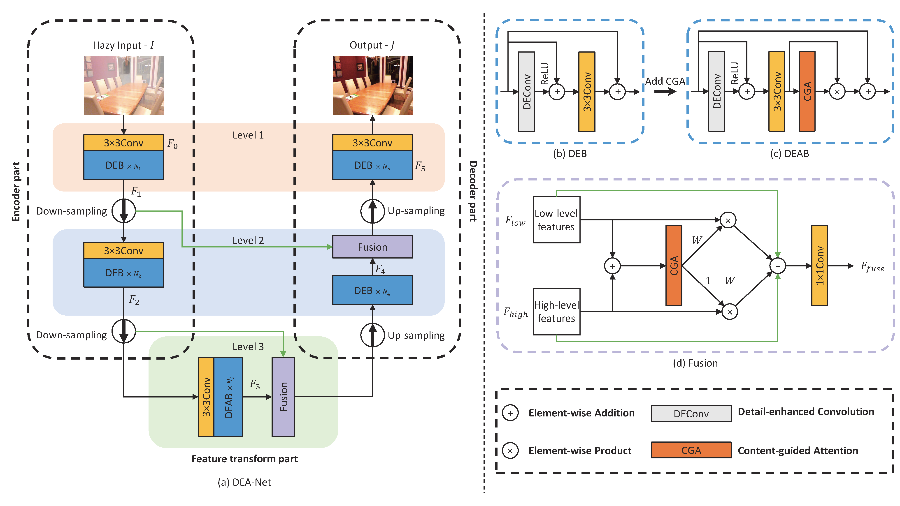
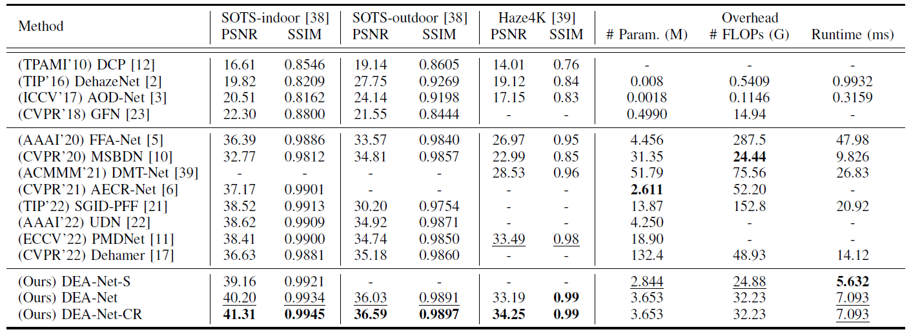

[](https://paperswithcode.com/sota/image-dehazing-on-haze4k?p=dea-net-single-image-dehazing-based-on-detail) 

[](https://paperswithcode.com/sota/image-dehazing-on-sots-indoor?p=dea-net-single-image-dehazing-based-on-detail) 
[](https://paperswithcode.com/sota/image-dehazing-on-sots-outdoor?p=dea-net-single-image-dehazing-based-on-detail)
# DEA-Net: Single image dehazing based on detail-enhanced convolution and content-guided attention

[](https://arxiv.org/abs/2301.04805)
[](https://drive.google.com/drive/folders/1Rjb8dpyNnvvr0XLvIX9fg8Hdru_MhMCj?usp=sharing)
[](https://pan.baidu.com/s/1retfKIs_Om-D4zA45sL6Kg?pwd=dcyb)

This repo is the official implementation of "[DEA-Net: Single image dehazing based on detail-enhanced convolution and content-guided attention](https://arxiv.org/abs/2301.04805)".

**News**:

- Jan 11, 2023: Released evaluation codes and reparameterized pre-trained models.

## Overall Architecture



## Results



## Getting Started

### Environment

1. Clone this repo:

```
git clone https://github.com/cecret3350/DEA-Net.git
cd DEA-Net/
```

2. Create a new conda environment and install dependencies:

```
conda create -n pytorch_1_10 python=3.8
conda activate pytorch_1_10
conda install pytorch==1.10.0 torchvision==0.11.0 torchaudio==0.10.0 cudatoolkit=11.3 -c pytorch -c conda-forge
pip install -r requirements.txt
```
When evaluating on OTS with jpeg images as input, please make sure that the version of pillow is 8.3.2, this is to ensure that the same decoding algorithm is used for jpeg images during evaluation and training.
### Data Preparation

1. Download the dataset: [[RESIDE](https://sites.google.com/view/reside-dehaze-datasets/reside-v0)] and [[HAZE4K](https://github.com/liuye123321/DMT-Net)].
2. Make sure the file structure is consistent with the following:

```
dataset/
├── HAZE4K
│   ├── test
│   |   ├── clear
│   |   │   ├── 1.png
│   |   │   └── 2.png
│   |   │   └── ...
│   |   └── hazy
│   |       ├── 1_0.89_1.56.png
│   |       └── 2_0.93_1.66.png
│   |       └── ...
│   └── train
│       ├── clear
│       │   ├── 1.png
│       │   └── 2.png
│       │   └── ...
│       └── hazy
│           ├── 1_0.68_0.66.png
│           └── 2_0.59_1.95.png
│           └── ...
├── ITS
│   ├── test
│   |   ├── clear
│   |   │   ├── 1400.png
│   |   │   └── 1401.png
│   |   │   └── ...
│   |   └── hazy
│   |       ├── 1400_1.png
│   |       └── ...
│   |       └── 1400_10.png
│   |       └── 1401_1.png
│   |       └── ...
│   └── train
│       ├── clear
│       │   ├── 1.png
│       │   └── 2.png
│       │   └── ...
│       └── hazy
│           ├── 1_1_0.90179.png
│           └── ...
│           └── 1_10_0.98796.png
│           └── 2_1_0.99082.png
│           └── ...
└── OTS
    ├── test
    |   ├── clear
    |   │   ├── 0001.png
    |   │   └── 0002.png
    |   │   └── ...
    |   └── hazy
    |       ├── 0001_0.8_0.2.jpg
    |       └── 0002_0.8_0.08.jpg
    |       └── ...
    └── train
        ├── clear
        │   ├── 0005.jpg
        │   └── 0008.jpg
        |	└── ...
        └── hazy
            ├── 0005_0.8_0.04.jpg
            └── 0005_1_0.2.jpg
            └── ...
            └── 0008_0.8_0.04.jpg
            └── ...
```

### Evaluation

1. Download the pre-trained models on [[Google Drive](https://drive.google.com/drive/folders/1Rjb8dpyNnvvr0XLvIX9fg8Hdru_MhMCj?usp=sharing)] or [[Baidu Disk](https://pan.baidu.com/s/1retfKIs_Om-D4zA45sL6Kg) (password: dcyb)].
2. Make sure the file structure is consistent with the following:

```
trained_models/
├── HAZE4K
│   └── PSNR3426_SSIM9985.pth
├── ITS
│   └── PSNR4131_SSIM9945.pth
└── OTS
    └── PSNR3659_SSIM9897.pth
```

3. Run the following script to evaluation the pre-trained model:

```
cd code/
python3 eval.py --dataset HAZE4K --model_name DEA-Net-CR --pre_trained_model PSNR3426_SSIM9885.pth
python3 eval.py --dataset ITS --model_name DEA-Net-CR --pre_trained_model PSNR4131_SSIM9945.pth
python3 eval.py --dataset OTS --model_name DEA-Net-CR --pre_trained_model PSNR3659_SSIM9897.pth
```

4. (Optional) Run the following script to evaluation the pre-trained model and save the inference results:

```
cd code/
python3 eval.py --dataset HAZE4K --model_name DEA-Net-CR --pre_trained_model PSNR3426_SSIM9885.pth --save_infer_results
python3 eval.py --dataset ITS --model_name DEA-Net-CR --pre_trained_model PSNR4131_SSIM9945.pth --save_infer_results
python3 eval.py --dataset OTS --model_name DEA-Net-CR --pre_trained_model PSNR3659_SSIM9897.pth --save_infer_results
```
Inference results will be saved in ```experiment/<dataset>/<model_name>/<pre_trained_model>/```

## Citation
If you find our paper and repo are helpful for your research, please consider citing:

```bibtex
@article{chen2023dea,
  title={DEA-Net: Single image dehazing based on detail-enhanced convolution and content-guided attention},
  author={Chen, Zixuan and He, Zewei and Lu, Zhe-Ming},
  journal={arXiv preprint arXiv:2301.04805},
  year={2023}
}
```

## Contact
If you have any questions or suggestions about our paper and repo, please feel free to concat us via <22224039@zju.edu.cn> or <zeweihe@zju.edu.cn>.
